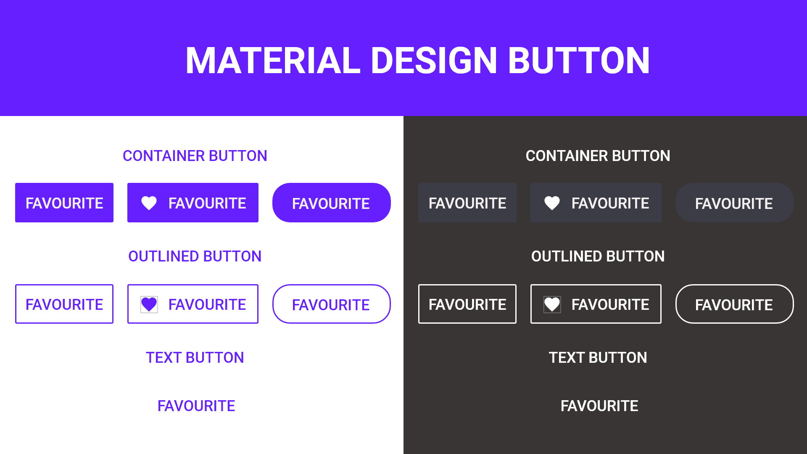

# Material-Buttons
MATERIAL DESIGN buttons is a library which focuses on providing pre designed buttons for user to uses easily whithout defining any dimension 
and color. These are available in different color as per your choice and can easily be modifed by given variables

# Introduction
Material buttons uses few xml attributes that you can easily use in your view
to use this design , first implement this in your build.gradle

    implementation 'com.github.BotCode97:Material-Buttons:1.2.3'
    
and this code in root file 

allprojects {

    repositories {
        google()
        jcenter()
        maven { url 'https://jitpack.io' }

    }   
}

Now you have imported all the files needed to use this library. Now simple implement it
like this

    <com.ssd.action.materialbutton2.materialbutton
        android:layout_width="wrap_content"
        android:layout_height="wrap_content"
        android:layout_marginStart="200dp"
        android:layout_marginTop="400dp"
        android:layout_marginEnd="200dp"
        android:layout_marginBottom="400dp"
        app:Outlined="true"
        app:layout_constraintBottom_toBottomOf="parent"
        app:layout_constraintEnd_toEndOf="parent"
        app:layout_constraintStart_toStartOf="parent"
        app:layout_constraintTop_toTopOf="parent"
        app:text="@string/app_name" />

    
